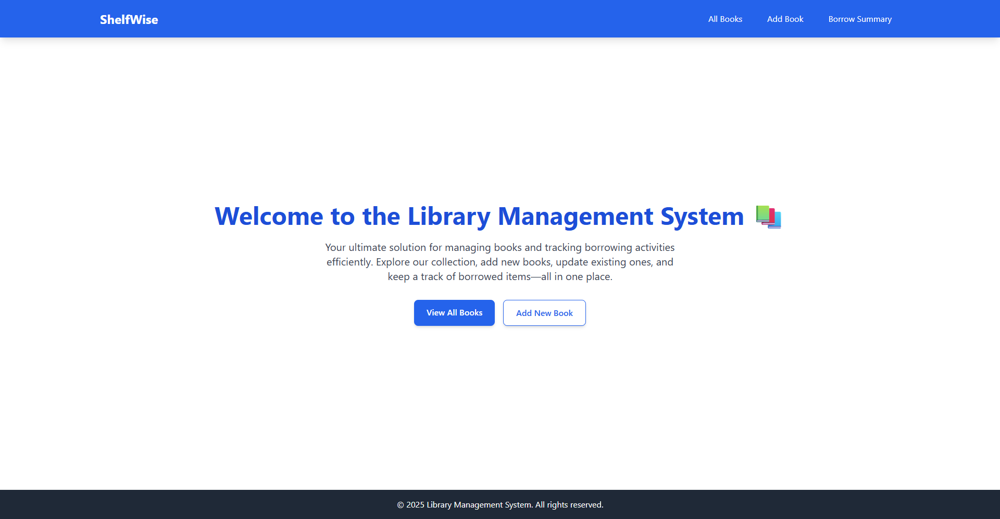

# 🚀 Minimal Library Management System (Frontend)

<div align="center">
  
</div>

## 🌐 [Live Deployment Link](https://shelfwise-teal.vercel.app/)
## 🔗 [Backend Repository Link](https://github.com/maksudulhaque2000/Assignment-3-L2)

This project is a meticulously crafted, clean, functional, and highly responsive client-side application designed to empower efficient management of books and precise tracking of borrowing activities within a library system. It offers a seamless user experience by interacting with a separate RESTful API backend, prioritizing robust state management, intuitive UI design, and essential core functionalities without the complexities of authentication or advanced filtering.

## ✨ Core Features & Functionalities

-   **Public Accessibility:** All application pages are readily available without requiring any login or authentication, ensuring a straightforward and accessible user experience focused purely on core library operations.

-   **Comprehensive Book Management (CRUD & Pagination):**
    -   **Dynamic Book List:** Displays all available books in a clear, paginated table format. Each page is configured to efficiently load and show 10 books.
        -   **Intuitive Pagination Controls:** Navigate effortlessly through extensive book collections using "Previous," "Next," and direct page number buttons. Provides clear feedback on the current page and total items.
    -   **Add New Book:** A dedicated, type-safe form allows librarians to easily add new book records with all necessary details. Newly added books are reflected instantly in the main book list.
    -   **Edit Book Details:** Enables seamless modification of existing book information through a pre-populated form. All updates are applied and displayed in the UI in real-time.
    -   **Secure Book Deletion:** Facilitates the permanent removal of book records, accompanied by a confirmation dialog (powered by SweetAlert2) to prevent accidental data loss. Deletions are immediately synchronized with the UI.

-   **Efficient Borrowing System:**
    -   **Streamlined Borrow Form:** A user-friendly form, accessible directly from the book list, simplifies the process of recording book borrowing transactions. Users specify quantity and desired due date.
    -   **Intelligent Business Logic:** The system ensures that books can only be borrowed if sufficient copies are physically available. Quantity inputs are rigorously validated against current stock levels.
    -   **Instant Inventory Updates:** Successfully borrowing a book immediately updates its available copy count and overall availability status in the main book list.

-   **Borrow Summary & Insights:**
    -   Presents a clear, aggregated overview of all books that have been borrowed. This summary includes the book title, ISBN, and the total quantity borrowed for each specific title, providing valuable insights derived from backend aggregation.

## 🎨 UI/UX & User Experience Enhancements

-   **Minimalist & Modern Design:** The application boasts a clean, uncluttered, and highly functional user interface, meticulously crafted with **Tailwind CSS** for a contemporary aesthetic.
-   **Adaptive & Responsive Layout:** The UI is fully responsive, gracefully adjusting its layout and components to provide an optimal viewing and interaction experience across various screen sizes, including mobile phones, tablets, and desktop monitors. The navigation bar features a collapsible "hamburger" menu for smaller devices.
-   **Proactive User Feedback:**
    -   **Toast Notifications (react-toastify):** Provides unobtrusive, context-sensitive feedback messages for both successful API operations (e.g., "Book created successfully!") and encountered errors.
    -   **Interactive Alerts (SweetAlert2):** Utilizes visually appealing and customizable dialog boxes for critical confirmations (e.g., "Are you sure you want to delete?") and for displaying clear, actionable input validation messages.
-   **Real-time Data Synchronization:** Leverages **Redux Toolkit Query's tag invalidation** capabilities to automatically synchronize the UI with backend data changes. This means lists and details update instantly after any create, update, or delete operation, eliminating the need for manual page refreshes.
-   **Dynamic Loading Indicators:** Displays clear loading spinners when asynchronous data fetching or form submissions are in progress, providing visual cues to the user and enhancing perceived performance.

## 🚀 Technology Stack

This project is built using a modern and robust technology stack:

### Frontend Layer
-   **React.js:** The core library for building dynamic user interfaces.
-   **TypeScript:** Provides static typing for improved code quality, readability, and maintainability.
-   **Redux Toolkit:** The official, opinionated, and efficient way to write Redux logic, simplifying state management.
-   **Redux Toolkit Query (RTK Query):** A powerful data fetching and caching layer integrated with Redux Toolkit, streamlining API interactions and managing server state.
-   **React Router DOM:** Essential for declarative routing within the single-page application.
-   **Tailwind CSS:** A highly customizable, utility-first CSS framework for rapid UI development.
-   **react-toastify:** For non-blocking, user-friendly notifications.
-   **sweetalert2 & sweetalert2-react-content:** For attractive and interactive alert/confirmation dialogs.

### Backend Integration
-   **Node.js:** The JavaScript runtime powering the backend API.
-   **Express.js:** The minimalist web framework used to build the RESTful API endpoints.
-   **MongoDB:** The NoSQL document database for efficient data storage.
-   **Mongoose:** An elegant ODM (Object Data Modeling) library for MongoDB and Node.js.

### Developer Tools & Utilities
-   **ESLint:** A static code analysis tool integrated to enforce code quality and style consistency.
-   **Prettier:** An opinionated code formatter ensuring uniform code formatting across the project.
-   **Nodemon:** For automatic server restarts during backend development.
-   **dotenv:** For secure management of environment variables.

## 🔗 Live Demos & Repositories

Explore the live application and its backend API:

-   **Frontend Live Demo:** [https://shelfwise-teal.vercel.app/](https://shelfwise-teal.vercel.app/)
-   **Backend Live API:** [https://assignment-3-l2-three.vercel.app](https://assignment-3-l2-three.vercel.app)
-   **Backend GitHub Repository:** [https://github.com/maksudulhaque2000/Assignment-3-L2](https://github.com/maksudulhaque2000/Assignment-3-L2)

## 🛠️ Setup & Local Installation

Follow these steps to get the frontend project running on your local machine for development and testing.

### Prerequisites

-   **Node.js (LTS recommended):** Download from [nodejs.org](https://nodejs.org/).
-   **npm:** Node Package Manager (comes with Node.js).
-   **Backend API:** Ensure your backend API is running locally or deployed and accessible via the `REACT_APP_API_BASE_URL`.

### Installation Steps

1.  **Clone the repository:**
    ```bash
    git clone [https://github.com/maksudulhaque2000/Assignment-4-L2](https://github.com/maksudulhaque2000/Assignment-4-L2)
    cd library-management-frontend
    ```

2.  **Install project dependencies:**
    ```bash
    npm install
    ```
    *Note: If you encounter peer dependency conflicts (e.g., with `@typescript-eslint` packages), ensure you are using versions compatible with `react-scripts@5.0.1` (e.g., `5.x.x` versions for `@typescript-eslint`). A clean install (`rm -rf node_modules && rm package-lock.json && npm install`) often resolves such issues.*

3.  **Create a `.env` file:**
    In the root directory of your project, create a file named `.env` and add your backend API's base URL:

    ```env
    # .env
    REACT_APP_API_BASE_URL=[https://assignment-3-l2-three.vercel.app/api](https://assignment-3-l2-three.vercel.app/api)
    ```

## 🚀 Available Scripts

In the project directory, you can run:

-   **`npm start`**:
    Runs the app in the development mode.
    Open [http://localhost:3000](http://localhost:3000) (or another port if 3000 is occupied) to view it in your browser. The page will reload when you make changes. Any lint warnings will appear in the console.

-   **`npm test`**:
    Launches the test runner in the interactive watch mode.

-   **`npm run build`**:
    Builds the app for production to the `build` folder.
    It correctly bundles React in production mode and optimizes the build for the best performance. The build is minified and the filenames include the hashes. Your app is ready to be deployed!

-   **`npm run lint`**:
    Checks your source code for potential errors and style inconsistencies using ESLint.

-   **`npm run lint:fix`**:
    Automatically fixes most fixable linting errors and formatting issues in your source code.

-   **`npm run eject`**:
    **Note: this is a one-way operation. Once you `eject`, you can't go back!**
    This command will copy all the configuration files and transitive dependencies (webpack, Babel, ESLint, etc.) directly into your project, giving you full control over them.

## 🌐 Page List / Routes

-   `/` (Home Page): Displays a welcoming message and general information about the system.
-   `/books`: Lists all books available in the library with pagination, and provides actions (Edit, Delete, Borrow).
-   `/create-book`: A dedicated form to add a new book record.
-   `/edit-book/:id`: A form to update details of an existing book, identified by its ID.
-   `/borrow/:bookId`: A form to initiate the borrowing process for a specific book.
-   `/borrow-summary`: Displays an aggregated summary of all borrowed books across the library.
-   `*` (Any other path): Navigates to a custom 404 Not Found page for undefined routes.

## 🚀 Deployment

This frontend application is designed for seamless deployment on various static site hosting platforms.

-   **Vercel Deployment:** The project is configured for easy deployment on Vercel. Ensure `REACT_APP_API_BASE_URL` is set as an Environment Variable within your Vercel project settings.

## 🤝 Contributing

Contributions are welcome! Feel free to fork the repository, open issues, or submit pull requests if you have suggestions or improvements.

## 📄 License

This project is for personal and educational use. All rights reserved by **[Maksudul Haque]**.

Copyright © 2025 [Maksudul Haque]